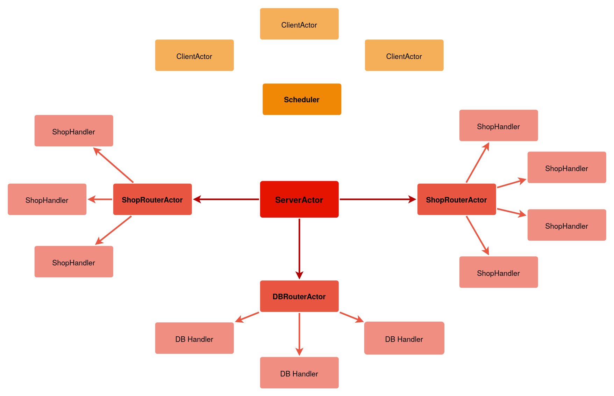
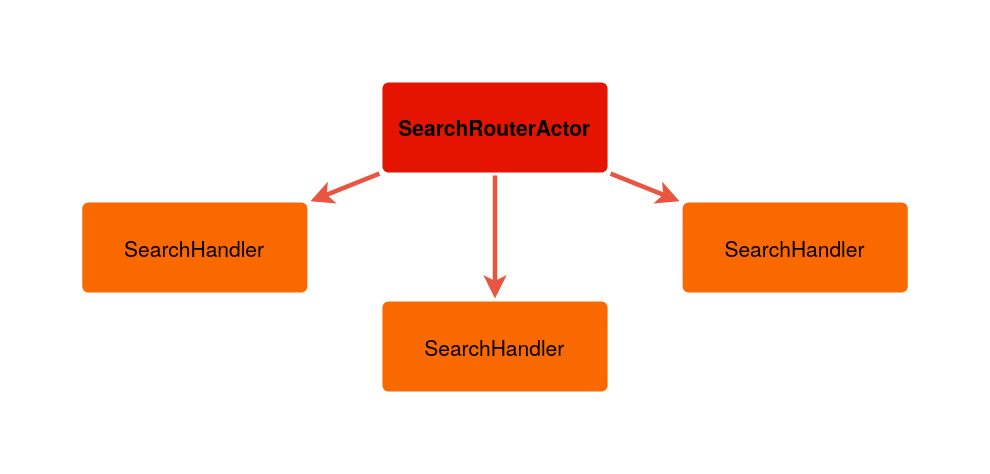
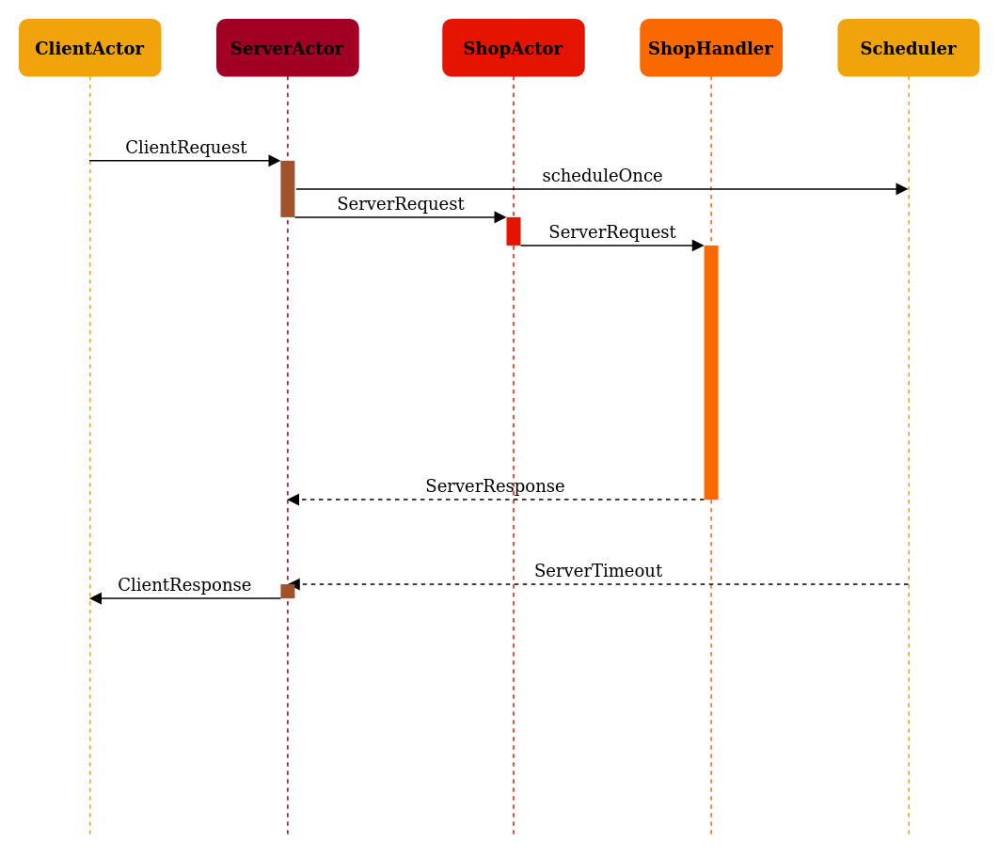

# Akka Shop System -  Michał Dygas

## Architektura Systemu


Diagram przedstawia architekturę systemu, która jest wykrzystana w zadaniu 1 i 2. W celu uzyskania jak najmniejszego opóźnienia, wykorzystana została technika load balancingu zapytań na N dzieci. Dziecko odpowiedzialne za dane zapytanie jest wyznaczane za pomocą operacji modulo - ```id % children```.
Id zapytań są wyznaczane przez ServerActor. Timeout został zaimplementowany za pomocą Schedulera - wbudowanej funkcjonalności ActorSystemu, która pozwala zaplanować wywołanie zapytania z opóźnieniem. W tym przypadku ServerActor ustala przypomnienie do siebie wraz z opóźnieniem wynoszącym **300ms**. W międzyczasie przetwarzając inne zapytania. 




W zadaniu 3 została dołożona funkcjonalność odpytywania o opinie serwisu __www.opineo.pl__. Pod odpowiedzialny za to endpoint został podpięty analogiczny system do zadania 1 i 2.

## Sekwencyjny Diagram Komunikacji


## Atomowość operacji na bazie danych
Atomowość operacji jest zapewniona poprzez umiejętne kierowanie przepływem zapytań z DatabaseActor'a do DBHandle. Id zostało zastąpione **hashem** nazwy produktu, w ten sposób zapytania o konkretny produkt zawsze będą kierowane do tego samego Handlera. Natomiast sekwencyjne przetwarzanie tych wiadomości ma zapewnić atomowość operacji na krotce.

## Endpointy 

Wyszukiwarka opinii o produkcie. Źródłem danych jest serwis www.opineo.pl
```$xslt
    localhost:8080/search/<NAME>
```

Wyszukiwarka cen produktu
```
    localhost:8080/price/<NAME>
```