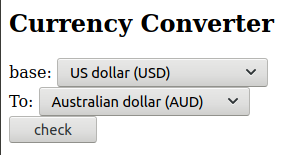
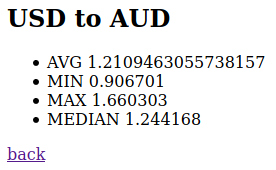

# Currency Exchange Ratio API

## Descripction
Here is basic Spring implementation of service that compares currency exchange ratio published by other RestAPI. Service does not support HTTPS or HTTP 2.0.

Build tool:
- maven

Source of financial rates:
- worldtradingdata.com
- frankfurter.app
- exchangeratesapi.io
- prime.exchangerate-api.com

Supported Curriencies:
- USD
- EUR
- JPY
- GBP
- AUD
- CAD
- CHF
- SEK
- NZD
- PLN

## Typical usage
1. Step one - pick currencies
    
    
2. Output
    
    
3. Go back do step one

## /convert endpoint

Service publishes information also in json format. GET request requires those parameters:
- base: base currency
- convertTo: exchange to currency

example:
```
GET http://localhost:8080/convert?mediaType=json&base=USD&convertTo=GBP
```

## Run from command line

Go to project directory and paste
```
mvn install
mvn spring-boot:run
```
